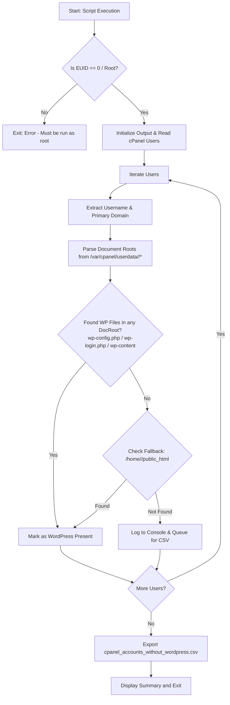

# cPanel Non-WordPress Account Detector

A lightweight administrative utility for cPanel/WHM servers to identify and audit cPanel accounts that do not have WordPress installed. Available in both **Bash** and **Python 3** implementations.

Both scripts scan all domain document roots (primary, addon, and subdomains) for each user and export a CSV report of accounts without WordPress.

---

## Implementations

| Script | Runtime | Best For | Key Features |
| :--- | :--- | :--- | :--- |
| [`non-wp-detect.sh`](file:///home/gekkostate/Documents/repo/cpanel-detect-non-wp-user/non-wp-detect.sh) | `/bin/bash` | Quick audits, zero-install environments | Pure shell using standard POSIX utilities (`awk`, `grep`, `cut`, `printf`). |
| [`non-wp-detect.py`](file:///home/gekkostate/Documents/repo/cpanel-detect-non-wp-user/non-wp-detect.py) | `Python 3` | Robust reporting, automated pipelines | Modular design, sorted user ordering, resilient utf-8 handling, standard library `csv.DictWriter`. |

---

## Features

- **Multi-Domain Document Root Discovery**: Parses `/var/cpanel/userdata/<user>` to locate document roots across all domains attached to an account (primary domains, addon domains, and subdomains).
- **Public HTML Fallback**: Checks standard `/home/<user>/public_html` if userdata configuration is missing or empty.
- **Accurate WordPress Signatures**: Inspects discovered document roots for core WordPress indicators:
  - `wp-config.php`
  - `wp-login.php`
  - `wp-content/`
- **Formatted Console Output**: Displays a formatted ASCII table in real time.
- **CSV Export**: Automatically logs missing installations to `cpanel_accounts_without_wordpress.csv`.

---

## Prerequisites

### 1. Server Environment
- **Platform**: cPanel & WHM Linux server (CloudLinux, AlmaLinux, Rocky Linux, CentOS, or Ubuntu).
- **Shell**: Bash (`/bin/bash`).
- **Python (for Python script)**: Python 3.6+ installed (`python3`). No third-party packages (`pip`) required; uses standard library only (`os`, `glob`, `csv`, `pwd`).

### 2. User Privileges
- **Root Access (`EUID == 0`)**: Both scripts must be executed as `root` (or via `sudo`) to read protected directories under `/var/cpanel/` and user home directories (`/home/<user>/`).

### 3. Required File System Paths
The scripts rely on standard cPanel directory structures:
| Path | Purpose |
| :--- | :--- |
| `/var/cpanel/users/` | List of cPanel accounts and primary domain mappings (`domain=`). |
| `/var/cpanel/userdata/<user>/` | Apache vhost configurations defining `documentroot:` for all domains and subdomains. |
| `/home/<user>/public_html/` | Standard default web root used as fallback. |

---

## Architecture & Workflow



---

## Function Breakdown

### Python Version ([`non-wp-detect.py`](file:///home/gekkostate/Documents/repo/cpanel-detect-non-wp-user/non-wp-detect.py))

- `get_cpanel_users()`: Reads directory entries in `/var/cpanel/users` to discover all valid accounts.
- `get_user_primary_domain(username)`: Reads `/var/cpanel/users/<username>` with UTF-8 encoding (ignoring bad bytes) and extracts `domain=`. Returns `"Unknown"` if missing.
- `get_user_docroots(username)`:
  - Iterates through `/var/cpanel/userdata/<username>/*` (skipping `.cache` files and subdirectories).
  - Parses `documentroot:` entries, deduplicating paths.
  - Falls back to `/home/<username>/public_html` if no document roots are found.
- `has_wordpress(docroots)`: Iterates through document roots and returns `True` if `wp-config.php`, `wp-login.php`, or `wp-content/` exists.
- `main()`: Enforces root privilege check (`os.geteuid() != 0`), sorts users alphabetically, prints live table, and exports results using `csv.DictWriter`.

### Bash Version ([`non-wp-detect.sh`](file:///home/gekkostate/Documents/repo/cpanel-detect-non-wp-user/non-wp-detect.sh))

- **Root check (`lines 5-8`)**: Verifies `$EUID -eq 0`.
- **User loop (`lines 24-28`)**: Iterates `/var/cpanel/users/*` using `basename`.
- **Domain extraction (`lines 29-32`)**: Uses `grep '^domain='` and `cut -d= -f2`.
- **Docroot parsing (`lines 36-51`)**: Loops over `/var/cpanel/userdata/$user/*`, greps `documentroot:`, and checks WordPress indicator paths.
- **Fallback (`lines 54-61`)**: Inspects `/home/$user/public_html` if `has_wp` is 0.
- **Output & CSV (`lines 64-74`)**: Outputs with `printf` and appends CSV lines directly.

---

## Usage

Make scripts executable first:
```bash
chmod +x non-wp-detect.sh non-wp-detect.py
```

### Option A: Run the Python Script (Recommended)
```bash
sudo ./non-wp-detect.py
```
*Or directly via python3:*
```bash
sudo python3 non-wp-detect.py
```

### Option B: Run the Bash Script
```bash
sudo ./non-wp-detect.sh
```

---

## Output Examples

### Console Output
```text
=================================================================
USERNAME        | PRIMARY DOMAIN            | STATUS
-----------------------------------------------------------------
alpha_user      | alpha-example.com         | No WordPress Found
static_site     | mystaticsite.org          | No WordPress Found
test_account    | test.internal             | No WordPress Found
=================================================================
Scan complete. Found 3 accounts without WordPress.
[+] Results successfully exported to: /root/cpanel_accounts_without_wordpress.csv
```

### Generated CSV Report
File: `cpanel_accounts_without_wordpress.csv`
```csv
Username,Primary Domain,Status
alpha_user,alpha-example.com,No WordPress Found
static_site,mystaticsite.org,No WordPress Found
test_account,test.internal,No WordPress Found
```

---

## Considerations & Tips

1. **Subdirectory WordPress Installations**:
   Both scripts check the root level of each domain's document root and `/public_html`. If a user installed WordPress inside a subfolder (e.g. `public_html/blog/`), it will be reported as not having WordPress at root level.
2. **Suspended Accounts**:
   Suspended accounts still retain files under `/var/cpanel/users/` and will be scanned. If you wish to exclude suspended users, you can check for `SUSPENDED=1` in their user file.
3. **Encoding & Special Characters**:
   The Python script handles non-ASCII characters and UTF-8 decode issues gracefully with `errors="ignore"`.
