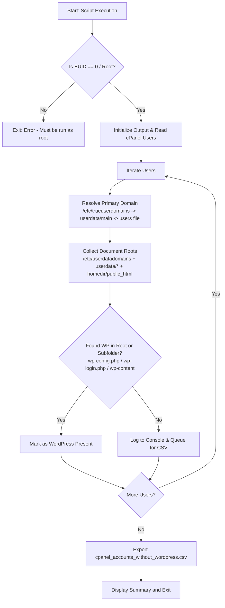

# cPanel Non-WordPress Account Detector

A lightweight administrative utility for cPanel/WHM servers to identify and audit cPanel accounts that do not have WordPress installed. Available in both **Bash** and **Python 3** implementations.

Both scripts scan all domain document roots (primary, addon, and subdomains) for each user and export a CSV report of accounts without WordPress.

---

## Implementations

| Script | Runtime | Best For | Key Features |
| :--- | :--- | :--- | :--- |
| [`non-wp-detect.sh`](file:///home/gekkostate/Documents/repo/cpanel-detect-non-wp-user/non-wp-detect.sh) | `/bin/bash` | Quick audits, zero-install environments | Pure shell using standard POSIX utilities (`awk`, `grep`, `cut`, `printf`). |
| [`non-wp-detect.py`](file:///home/gekkostate/Documents/repo/cpanel-detect-non-wp-user/non-wp-detect.py) | `Python 3` | Robust reporting, automated pipelines | Modular design, sorted user ordering, resilient utf-8 handling, standard library `csv.DictWriter`. |

---

## Features

- **Multi-Source Domain Resolution**: Resiliently determines primary domains by checking `/etc/trueuserdomains`, `/var/cpanel/userdata/<user>/main`, and `/var/cpanel/users/<user>`.
- **Multi-Source Document Root Discovery**: Combines `/etc/userdatadomains`, `/var/cpanel/userdata/<user>/*`, and dynamic user home directories from `/etc/passwd`.
- **Multi-Drive & Custom Partition Support**: Resolves actual home directories dynamically (e.g. `/home/`, `/home2/`, `/home3/`) via system user database instead of hardcoding `/home/<user>`.
- **Subdirectory Detection**: Checks both document root level and 1-level subdirectories (e.g. `/public_html/wordpress`, `/public_html/wp`, `/public_html/blog`) to eliminate false positives.
- **Accurate WordPress Signatures**: Checks for core WordPress indicators:
  - `wp-config.php`
  - `wp-login.php`
  - `wp-content/`
- **Formatted Console Output**: Displays an aligned table in real time as scanning progresses.
- **CSV Export**: Automatically logs missing installations to `cpanel_accounts_without_wordpress.csv`.

---

## Prerequisites

### 1. Server Environment
- **Platform**: cPanel & WHM Linux server (CloudLinux, AlmaLinux, Rocky Linux, CentOS, or Ubuntu).
- **Shell**: Bash (`/bin/bash`).
- **Python (for Python script)**: Python 3.6+ installed (`python3`). No third-party packages (`pip`) required; uses standard library only (`os`, `glob`, `csv`, `pwd`).

### 2. User Privileges
- **Root Access (`EUID == 0`)**: Both scripts must be executed as `root` (or via `sudo`) to read protected directories under `/var/cpanel/` and user home directories.

### 3. Required File System Paths
The scripts utilize standard cPanel configuration and cache files:
| Path | Purpose |
| :--- | :--- |
| `/etc/trueuserdomains` | Authoritative server-wide mapping of primary domains to usernames (`domain.com: user`). |
| `/etc/userdatadomains` | Consolidated index mapping every domain/subdomain to its respective document root. |
| `/var/cpanel/users/` | Directory of cPanel account configuration files. |
| `/var/cpanel/userdata/<user>/` | Apache vhost configurations defining `documentroot:` for all domains and subdomains. |
| `/etc/passwd` | Resolves actual user home directories (`/home`, `/home2`, etc.). |

---

## Architecture & Workflow



---

## Function Breakdown

### Python Version ([`non-wp-detect.py`](file:///home/gekkostate/Documents/repo/cpanel-detect-non-wp-user/non-wp-detect.py))

- `get_cpanel_users()`: Reads `/var/cpanel/users`, filtering out system users (`system`, `nobody`, `cpanel`, `root`) and hidden entries.
- `get_user_primary_domain(username)`: Cascades across `/etc/trueuserdomains`, `/var/cpanel/userdata/<user>/main`, and `/var/cpanel/users/<user>`. Strips quotes and carriage returns.
- `get_user_docroots(username)`:
  - Scans `/etc/userdatadomains` to pull all registered vhost docroots.
  - Inspects `/var/cpanel/userdata/<username>/*` (skipping `main` and `.cache`), stripping quotes.
  - Uses `pwd.getpwnam(username).pw_dir` to find the user's real home directory (`/home`, `/home2`, etc.) and appends `public_html`.
- `has_wordpress(docroots)`: Checks each document root and its 1-level subdirectories for `wp-config.php`, `wp-login.php`, or `wp-content`.
- `main()`: Enforces root privilege check (`os.geteuid() != 0`), sorts users alphabetically, prints live table, and exports results using `csv.DictWriter`.

### Bash Version ([`non-wp-detect.sh`](file:///home/gekkostate/Documents/repo/cpanel-detect-non-wp-user/non-wp-detect.sh))

- **Root Check (`lines 4-7`)**: Verifies `$EUID -eq 0`.
- **WordPress Helper `check_wp` (`lines 20-39`)**: Checks a directory and its 1-level subdirectories for core WordPress files.
- **User Iteration (`lines 42-48`)**: Scans `/var/cpanel/users/*`, skipping hidden and system users.
- **Domain Extraction (`lines 50-65`)**: Queries `/etc/trueuserdomains` first, then `/var/cpanel/userdata/$user/main`, then `DNS=`/`domain=`.
- **Docroot Resolution (`lines 69-95`)**: Combines `/etc/userdatadomains`, `/var/cpanel/userdata/$user/*`, and `getent passwd "$user"` fallback.
- **Detection & Export (`lines 97-117`)**: Runs `check_wp` against unique document roots and logs missing installations to console and CSV.

---

## Usage

Make scripts executable first:
```bash
chmod +x non-wp-detect.sh non-wp-detect.py
```

### Option A: Run the Python Script (Recommended)
```bash
sudo ./non-wp-detect.py
```
*Or directly via python3:*
```bash
sudo python3 non-wp-detect.py
```

### Option B: Run the Bash Script
```bash
sudo ./non-wp-detect.sh
```

---

## Output Examples

### Console Output
```text
=================================================================
Scanning cPanel accounts for missing WordPress installations...
=================================================================
USERNAME        | PRIMARY DOMAIN                 | STATUS
-----------------------------------------------------------------
alpha_user      | alpha-example.com              | No WordPress Found
static_site     | mystaticsite.org               | No WordPress Found
test_account    | test.internal                  | No WordPress Found
=================================================================
Scan complete. Found 3 accounts without WordPress.
[+] Results successfully exported to: /root/cpanel_accounts_without_wordpress.csv
```

### Generated CSV Report
File: `cpanel_accounts_without_wordpress.csv`
```csv
Username,Primary Domain,Status
alpha_user,alpha-example.com,No WordPress Found
static_site,mystaticsite.org,No WordPress Found
test_account,test.internal,No WordPress Found
```
