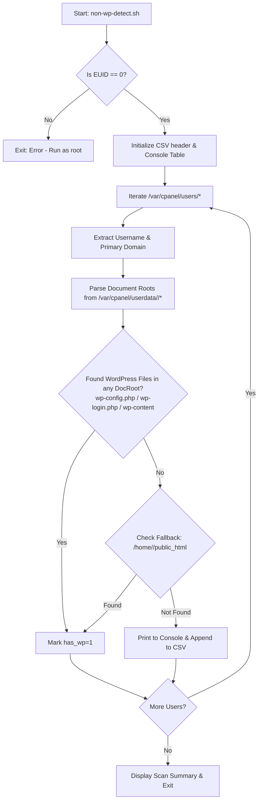

# cPanel Non-WordPress Account Detector

A lightweight Bash utility for cPanel/WHM server administrators to identify and audit cPanel accounts that do not have WordPress installed. The script scans all domain document roots (primary, addon, and subdomains) for each user and exports a CSV report of accounts without WordPress.

---

## Features

- **Multi-domain Document Root Discovery**: Reads `/var/cpanel/userdata/<user>` to locate document roots across all domains attached to an account (primary domains, addon domains, and subdomains).
- **Public HTML Fallback**: Checks standard `/home/<user>/public_html` if userdata configuration is missing or empty.
- **Accurate WordPress Signatures**: Checks for core WordPress identifiers:
  - `wp-config.php`
  - `wp-login.php`
  - `wp-content/`
- **Formatted Console Output**: Displays a neat, aligned ASCII table in real time as the scan progresses.
- **CSV Export**: Automatically logs missing installations to `cpanel_accounts_without_wordpress.csv` for reporting and migration planning.

---

## Prerequisites

### 1. Server Environment
- **Platform**: cPanel & WHM Linux server (CentOS, CloudLinux, AlmaLinux, Rocky Linux, or Ubuntu).
- **Shell**: Bash (`/bin/bash`).

### 2. User Privileges
- **Root Access (`EUID == 0`)**: The script must be run as `root` (or via `sudo`) to inspect `/var/cpanel/` and read user home directories.

### 3. Core System Utilities
The script depends only on standard Unix core tools available by default on all cPanel servers:
- `bash`
- `awk`
- `grep`
- `cut`
- `basename`
- `printf`

### 4. Required File System Paths
The script relies on standard cPanel directory structures:
| Path | Purpose |
| :--- | :--- |
| `/var/cpanel/users/` | List of cPanel accounts and primary domain mappings (`domain=`). |
| `/var/cpanel/userdata/<user>/` | Apache vhost configurations defining `documentroot:` for all domains and subdomains. |
| `/home/<user>/public_html/` | Standard default web root used as fallback. |

---

## How It Works



### Detailed Script Functions

1. **Root Verification (`lines 5-8`)**
   Checks `$EUID`. If the user is not root, displays an error and exits with code 1.

2. **Output Initialization (`lines 10-21`)**
   Creates (or truncates) `cpanel_accounts_without_wordpress.csv` and writes the header:
   ```csv
   Username,Primary Domain,Status
   ```
   Prints table headers to stdout.

3. **User Enumeration (`lines 24-28`)**
   Iterates through each account file located in `/var/cpanel/users/`. The filename corresponds to the cPanel username.

4. **Primary Domain Parsing (`lines 29-32`)**
   Extracts the account's primary domain using `grep '^domain='` from the cPanel user configuration file.

5. **Document Root Inspection (`lines 36-51`)**
   Iterates through non-cache configuration files in `/var/cpanel/userdata/$user/`. Extracts the `documentroot:` entry for each domain and checks if any of the following exist inside that directory:
   - `wp-config.php`
   - `wp-login.php`
   - `wp-content/`

6. **Fallback Web Root Check (`lines 54-61`)**
   If no WordPress installation was found in the vhost document roots, checks `/home/$user/public_html` directly.

7. **Logging and Reporting (`lines 64-69`)**
   If no WordPress installation is detected across any examined paths:
   - Prints the user and domain to the console table.
   - Appends a record to the CSV file.
   - Increments the total counter.

8. **Summary (`lines 72-74`)**
   Outputs the final tally of accounts without WordPress and the absolute path to the generated CSV report.

---

## Usage

### 1. Download or Place the Script
Place [non-wp-detect.sh](file:///home/gekkostate/Documents/repo/cpanel-detect-non-wp-user/non-wp-detect.sh) on your cPanel server (e.g. in `/root/` or any administrative directory).

### 2. Grant Execute Permission
```bash
chmod +x non-wp-detect.sh
```

### 3. Execute as Root
```bash
./non-wp-detect.sh
```
or
```bash
sudo ./non-wp-detect.sh
```

### Example Console Output
```text
=================================================================
Scanning cPanel accounts for missing WordPress installations...
=================================================================
USERNAME        | PRIMARY DOMAIN            | STATUS
-----------------------------------------------------------------
clienta         | clienta-example.com       | No WordPress Found
staticuser      | portfolio-static.org      | No WordPress Found
-----------------------------------------------------------------
=================================================================
Scan complete. Found 2 accounts without WordPress.
[+] Results successfully exported to: /root/cpanel_accounts_without_wordpress.csv
```

### Example CSV Output
`cpanel_accounts_without_wordpress.csv`:
```csv
Username,Primary Domain,Status
clienta,clienta-example.com,No WordPress Found
staticuser,portfolio-static.org,No WordPress Found
```

---

## Notes & Recommendations

1. **Unused Temporary File**:
   Line 11 allocates a temporary file via `TEMP_FILE=$(mktemp)`, but `TEMP_FILE` is not currently referenced in the script. You can safely remove this line or add a trap (`trap 'rm -f "$TEMP_FILE"' EXIT`) if you plan to use it for intermediate filtering.
2. **Subdirectory WordPress Installations**:
   The script checks the root of each domain's `documentroot` and `/public_html`. If a user installed WordPress in a subfolder (e.g., `public_html/blog/`), this script will treat the account as not having WordPress at root level unless checked recursively.
3. **Suspended Accounts**:
   Suspended accounts still exist under `/var/cpanel/users/` and will be scanned. If you wish to filter out suspended accounts, you can check for `SUSPENDED=1` in `/var/cpanel/users/$user`.
